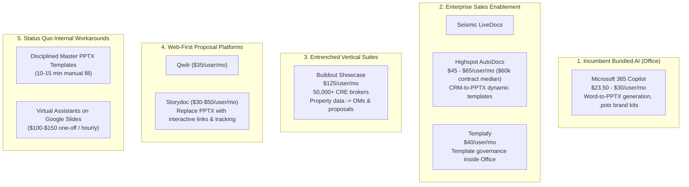

# Stage 1 Judge Report: Vertical B2B Deck / Sales-Collateral Automation

**Idea ID**: `deck-automation`  
**Evaluation Date**: 2026-09-08  
**Final Verdict**: **FAIL**  
**Stage 2 Authorized**: **NO (False)**  
**Condition**: None (Verdict is FAIL)  

---

## 1. Evaluated Hypothesis and Scope

### 1.1 Written Hypothesis
> "B2B teams that regularly create customer-specific sales decks spend meaningful recurring time adapting PowerPoint presentations to individual opportunities. Existing presentation AI tools do not fully solve the workflow because teams require company-specific templates, trusted source material, accurate client customization, and reliably editable native PPTX output. A sufficiently painful segment can justify a B2B SaaS price materially above low-cost consumer presentation subscriptions."

### 1.2 Declared Market Scope & Constraints
- **Geography**: Global English-speaking
- **Business Type**: B2B
- **Company Size**: SMB and Mid-market
- **Exclusions**: Fortune 500, procurement-heavy enterprise, and heavily regulated workflows requiring substantial compliance work before pilot.
- **Economic Constraint**: Minimum target eventual ARPU of **$100 USD / month**.
- **Acquisition Model**: Founder-led outbound, remote sales, and self-service where feasible.
- **Delivery Model**: Solo technical founder with coding/research agents.
- **Product & MVP Constraints**: Buildable by a solo founder; no full custom presentation canvas/editor; native editable PPTX preferred.

### 1.3 Scope Integrity Protocol
This evaluation was conducted under strict Stage 1 judge rules using only canonical records with `audit_status: VERIFIED` from `ideas/deck-automation/evidence/evidence.jsonl`. Out of 88 raw collected evidence records:
- **52 records** are **VERIFIED** and eligible for gate consideration.
- **12 records** are **PARTIALLY_VERIFIED** (e.g., labor hours improperly recorded as currency, uncommitted hiring intent, or outdated vendor list pricing) and treated as strictly unavailable to satisfy thresholds.
- **24 records** are **REJECTED** (due to HTTP 404 broken links, decommissioned domains, duplicate user claims, non-atomic bundles, or severe forum overstatement) and completely excluded.
- **0 records** are **PENDING**.

Every gate count represents strictly unique `independence_key` entities. In compliance with scope integrity rules, each candidate ICP declared in `hypothesis.yaml` was evaluated on its own attributable evidence without pooling signals across unrelated segments. Broad presentation software records (such as general Gamma, Beautiful.ai, and Pitch export critiques) are applied only to evaluate the broad software capability gap (G4) and broad scope, never to artificially inflate narrow vertical candidates.

---

## 2. Executive Verdict and Decision Rationale

### Final Verdict: **FAIL** (Stage 2 **NOT AUTHORIZED**)

The hypothesis fails Stage 1 evaluation across multiple independent gates and is directly falsified on several foundational assumptions:

1. **Active Practitioner Pushback and Deck Abandonment in Core ICP**: The primary hypothesized user—the B2B SaaS Account Executive creating customer-specific pitch decks per opportunity—is actively moving away from presentation decks. Sales practitioners and sales leadership confirm that prospect meetings increasingly bypass slide decks in favor of live software walk-throughs and conversational discovery (`ev-skp-ae-ditching-decks`, `ev-pain-rep-disdain-for-decks`, `ev-pain-head-of-sales-deprecating-decks`, `ev-pain-faang-no-deck-workflow`). Reps state that forcing slide decks causes prospects to disengage, viewing them as canned pitches.
2. **Master Template Workaround Compresses Customization to 10–15 Minutes**: Where sales presentations remain necessary, disciplined 10-slide master PowerPoint files with explicit replacement instructions reduce per-deal customization labor to 10–15 minutes (`ev-pain-master-template-workaround`). Sales practitioners explicitly advise against paying for recurring deck software, preferring a one-time template investment with manual tweaks (`ev-wtp-contradiction-manual-template-pushback`).
3. **Bundled Incumbent AI Destroys the $100+/mo Pricing Wedge**: Microsoft 365 Copilot directly targets the core proposed value proposition by generating complete multi-slide presentations natively from structured Word documents inside PowerPoint (`ev-skp-m365-copilot-ppt-features`) and ingesting corporate `.potx` templates and organization Brand Kits (`ev-skp-m365-copilot-brand-templates`). Priced at $23.50 to $30 per user per month (`ev-skp-m365-copilot-pricing`), Microsoft sets a strict incumbent price anchor that destroys the viability of an unbundled, third-party $100+/month presentation SaaS for SMB and mid-market teams.
4. **Entrenched Enterprise Solutions and Governance Lockdowns**: In sales enablement, where budgets exist, platforms like Seismic LiveDocs (`ev-skp-seismic-livedocs-automation`) and Highspot AutoDocs (`ev-skp-highspot-pricing-procurement`) already automate CRM-to-PPTX dynamic generation. Furthermore, sales enablement and marketing leaders intentionally enforce template lockdowns to restrict sales rep autonomy and maintain brand control (`ev-skp-enablement-brand-lockdown`).
5. **Security & InfoSec Roadblocks Incompatible with Solo-Founder SMB Model**: Connecting automated deck software to CRM systems and confidential opportunity discovery notes triggers enterprise security reviews averaging 4.2 weeks and requiring mandatory SOC 2 Type II compliance and zero data retention (`ev-skp-infosec-procurement-hurdles`), contradicting the solo-founder low-touch acquisition constraints.
6. **Entrenched Vertical Incumbent in Commercial Real Estate**: In the commercial real estate (CRE) segment, Buildout Showcase already serves over 50,000 brokers nationwide with automated proposal and Offering Memorandum generation directly from property deal data (`ev-skp-buildout-cre-suite`), while institutional lenders report completely ignoring narrative deck pages (`ev-wtp-contradiction-cre-om-skepticism`).
7. **Threshold Deficits**: Gate 1 (Concrete Pain) achieves only 6 verified supporting signals against a required threshold of ≥ 20. Gate 5 (ICP Reachability) contains 0 verified records identifying a contactable market surface (LOW confidence).

Because core assumptions are strongly contradicted and no coherent declared candidate scope satisfies all six gates, Stage 2 prospect mining and interviews are **not authorized**.

---

## 3. Scope and Candidate ICP Coverage Matrix

The table below summarizes the audited coverage across the broad evaluated scope and all six candidate ICPs declared in `hypothesis.yaml`. Each candidate ICP is evaluated solely on evidence attributable to that specific segment.

| Scope / ICP | Attributable Verified Records | G1: Concrete Pain (≥20) | G2: Recurrence (Conf.) | G3: Spend/WTP (≥5 recs, ≥2 cats) | G4: Repeatable Gap (≥10) | G5: Reachability (Conf.) | G6: No Killer Substitute | Scope Verdict |
| :--- | :---: | :---: | :---: | :---: | :---: | :---: | :---: | :---: |
| **Broad Evaluated Scope** | **52** | **FAIL** (6 recs) | **FAIL** (LOW) | **PASS** (16 recs, 5 cats) | **PASS** (10 recs, 4 clusters) | **FAIL** (0 recs, LOW) | **FAIL** (Copilot, Seismic, Buildout) | **FAIL** |
| **B2B SaaS Account Executives** | 14 | **FAIL** (1 rec) | **FAIL** (LOW) | **FAIL** (3 recs, 2 cats) | **FAIL** (0 recs) | **FAIL** (0 recs, LOW) | **FAIL** (M365 Copilot, Master Templates) | **FAIL** |
| **Sales Enablement Teams / RevOps** | 8 | **FAIL** (2 recs) | **PASS** (MEDIUM) | **FAIL** (2 recs, 2 cats) | **FAIL** (0 recs) | **FAIL** (0 recs, LOW) | **FAIL** (Highspot, Seismic, Governance) | **FAIL** |
| **Boutique Consultancies** | 6 | **FAIL** (2 recs) | **PASS** (HIGH) | **FAIL** (3 recs, 1 cat) | **FAIL** (1 rec) | **FAIL** (0 recs, LOW) | **UNKNOWN** (think-cell, Claude scripts) | **FAIL** |
| **Commercial Real Estate Teams** | 6 | **FAIL** (0 recs) | **PASS** (MEDIUM) | **FAIL** (3 recs, 3 cats) | **FAIL** (0 recs) | **FAIL** (0 recs, LOW) | **FAIL** (Buildout Showcase, Lender apathy) | **FAIL** |
| **Agencies Producing Client Decks** | 4 | **FAIL** (1 rec) | **FAIL** (LOW) | **FAIL** (1 rec, 1 cat) | **FAIL** (0 recs) | **FAIL** (0 recs, LOW) | **FAIL** (Virtual Assistants, Qwilr) | **FAIL** |
| **Professional-Services Firms (MSPs)** | 1 | **FAIL** (0 recs) | **FAIL** (LOW) | **FAIL** (1 rec, 1 cat) | **FAIL** (0 recs) | **FAIL** (0 recs, LOW) | **UNKNOWN** (Insufficient data) | **FAIL** |
| *General / Cross-Segment / Software* | 13 | N/A | N/A | N/A (3 recs) | 9 recs | N/A | N/A | N/A |

*Note: In accordance with scope integrity rules, general presentation software records (e.g. Gamma export bugs, Beautiful.ai smart template rigidity) support only the broad solution gap and are not assigned to narrow candidate ICPs.*

---

## 4. Detailed Gate-by-Gate Analysis (Broad Evaluated Scope)

### 4.1 Gate 1 — Concrete Pain
- **Status**: **FAIL**
- **Decision Rule / Threshold**: At least 20 VERIFIED independent concrete pain signals (preferably ≥ 10 from core target ICPs) describing an actual workflow problem, cost, delay, error, frustration, risk, or workaround.
- **Counted Evidence Count**: **6 independent records** (6 unique independence keys).
- **Counted Evidence IDs**:
  1. `ev-pain-sales-qbr-hours-editing` (B2B SaaS AEs / Sales: reps dump hours into editing templates for QBRs or abandon personalization).
  2. `ev-pain-consulting-thirty-percent-time` (Management Consultants: ~30% of each workday consumed by PowerPoint formatting).
  3. `ev-pain-consulting-client-theme-rework` (Consultants: manual slide-by-slide recoloring of 30-page deck to match client brand theme).
  4. `ev-pain-pptx-master-slide-corruption` (Corporate Template Creators: pasting slides corrupts master templates and breaks brand consistency).
  5. `ev-pain-revops-sfdc-to-slides-manual-drain` (RevOps: manual copy-paste from Salesforce into customer decks consumes massive staff time).
  6. `ev-wf-agency-rfp-resource-drain` (Marketing Agencies: excessive resource hours consumed by detailed RFP proposal decks with 25% win rate).
- **Contradictory Evidence IDs (6 Records)**:
  1. `ev-pain-rep-disdain-for-decks`: Sales reps argue pitch decks do not close deals and cause prospective buyers to disengage.
  2. `ev-pain-master-template-workaround`: Disciplined 10-slide master template reduces per-opportunity customization time to 10–15 minutes.
  3. `ev-pain-faang-no-deck-workflow`: Enterprise tech sales reps report completely bypassing presentation decks for several years.
  4. `ev-pain-head-of-sales-deprecating-decks`: Head of Sales officially deprecated sales decks in favor of video and case studies.
  5. `ev-skp-ae-ditching-decks`: Modern AEs actively ditch slide decks during sales calls in favor of live software walk-throughs.
  6. `ev-skp-ae-deck-truncation`: Reps cut 30-slide pitch decks down to 7 slides or avoid slides except for rare massive deals/RFPs.
- **High-Impact Excluded Records**:
  - `ev-pain-consulting-daily-formatting-hours`: PARTIALLY_VERIFIED (3 hours of labor time erroneously entered as currency `$3.00 USD`).
  - `ev-pain-sales-pitch-obsolescence-debate`: PARTIALLY_VERIFIED (open discussion query asking for opinions, not concrete observed pain).
  - `ev-pain-dedicated-sales-analyst-deck-role`: REJECTED (unsupported claim of dedicated salary spend based on a 1-sentence comment).
  - `ev-pain-sales-enablement-deck-offloading`: REJECTED (severe overstatement of a 4-word forum comment).
  - `ev-skp-consulting-slide-formatting-synthesis`: REJECTED (non-atomic bundle of already-captured comments).
- **Confidence**: **LOW**.
- **Material Unknowns**: Whether unorganized presentation customization pain exists at scale in non-tech SMB sales teams without structured templates.

---

### 4.2 Gate 2 — Recurrence
- **Status**: **FAIL**
- **Decision Rule / Threshold**: At least MEDIUM confidence that the core job/problem recurs often enough for a SaaS relationship (e.g. weekly or per-opportunity high frequency). Subscription billing cadence, employment duration, or non-null recurrence on an unrelated record excluded.
- **Counted Evidence Count**: **15 independent records** (15 unique independence keys).
- **Counted Evidence IDs**:
  - `daily` (3 records): `ev-pain-consulting-thirty-percent-time`, `ev-wtp-consulting-formatting-time`, `ev-wf-cre-designer-indesign-bottleneck`.
  - `weekly` (2 records): `ev-pain-llm-thinking-vs-slide-admin`, `ev-pain-pptx-master-slide-corruption`.
  - `monthly` (2 records): `ev-wf-consulting-claude-skills-breakage`, `ev-wf-agency-rfp-resource-drain`.
  - `quarterly` (2 records): `ev-pain-sales-qbr-hours-editing`, `ev-wf-msp-qbr-multi-tool-drain`.
  - `per_client` (1 record): `ev-pain-consulting-client-theme-rework`.
  - `per_opportunity` (5 records): `ev-pain-revops-sfdc-to-slides-manual-drain`, `ev-wtp-cre-om-freelance-spend`, `ev-wtp-sales-highspot-enterprise-use`, `ev-wf-cre-om-turnaround-investor`, `ev-wf-cre-assembly-line-redlining`.
- **Contradictory Evidence IDs (7 Records)**:
  1. `ev-skp-ae-ditching-decks`: Core workflow recurrence is zero or ad-hoc as reps ditch decks for live software demos.
  2. `ev-skp-ae-deck-truncation`: Decks are minimized or bypassed entirely, reserved only for infrequent enterprise RFPs.
  3. `ev-pain-head-of-sales-deprecating-decks`: Leadership deprecation halts routine deck creation across the sales team.
  4. `ev-pain-faang-no-deck-workflow`: Multi-year zero recurrence for enterprise tech account executives.
  5. `ev-pain-rep-disdain-for-decks`: Routine deck usage rejected as counterproductive to sales outcomes.
  6. `ev-pain-master-template-workaround`: Per-opportunity customization compressed to 10–15 minutes, limiting user engagement depth.
  7. `ev-pain-sales-qbr-hours-editing`: Deck customization is quarterly (4 times/year), insufficient for an ongoing high-cost monthly SaaS subscription.
- **High-Impact Excluded Records**:
  - Excluded 8 vendor pricing records whose `monthly` recurrence reflects subscription billing cadence rather than core job frequency: `ev-mkt-plusai-pricing`, `ev-mkt-m365-copilot-pricing`, `ev-mkt-highspot-contract-floor`, `ev-mkt-thinkcell-spend`, `ev-mkt-templafy-capabilities`, `ev-mkt-qwilr-pricing-substitute`, `ev-skp-highspot-pricing-procurement`, `ev-skp-m365-copilot-pricing`.
  - `ev-wf-cre-om-12hr-buildout` and `ev-wf-consulting-monthly-deck-copy-paste`: PARTIALLY_VERIFIED (labor hours entered as currency).
  - `ev-wf-saas-am-qbr-hours-editing`, `ev-wf-saas-ae-master-slide-workaround`, `ev-wf-saas-ae-conversational-rejection`: REJECTED (duplicates).
- **Confidence**: **LOW** for hypothesized B2B AE sales deck creation; **MEDIUM** for general consulting and real estate document creation.
- **Material Unknowns**: Whether non-sales enterprise workflows (e.g. internal PMO governance or executive board reporting) have higher recurring frequency than opportunity pitch decks.

---

### 4.3 Gate 3 — Existing Spend / WTP
- **Status**: **PASS**
- **Decision Rule / Threshold**: At least 5 VERIFIED money signals from at least 2 distinct categories of spend. Excludes competitor pricing pages alone, vendor revenue, salary aggregates, or labor hours misclassified as currency.
- **Counted Evidence Count**: **16 independent supporting records** across **5 distinct spend categories** (16 unique independence keys).
- **Counted Evidence IDs by Spend Category**:
  1. `contractor_spend` (3 signals):
     - `ev-pain-outsourced-deck-freelancer`: Sales clients hire freelance designers for 10–20 hours/month on retainer for slide editing.
     - `ev-wtp-cre-om-freelance-spend`: Commercial real estate broker pays $1,000 upfront for master template + $100 per listing for slide completion.
     - `ev-wtp-startups-upwork-deck-spend`: Founder pays $150 USD on Upwork to polish pitch deck visual formatting.
  2. `saas_spend` (2 signals):
     - `ev-wtp-sales-highspot-enterprise-use`: SAS Institute sales leader confirms 3-year enterprise Highspot deployment specifically to manage latest pitch decks.
     - `ev-gap-copilot-firmwide-unusable-decks`: Firmwide enterprise Microsoft Copilot rollout ($30/user/mo) dedicated to Office presentation creation.
  3. `dedicated_role` (1 signal):
     - `ev-wf-cre-designer-indesign-bottleneck`: Full-time in-house graphic designer employed primarily to produce Offering Memorandums.
  4. `actual_purchase` (1 signal):
     - `ev-gap-storydoc-no-pptx-export-nasrullah`: 1-month paid subscription to Storydoc AI pitch generator.
  5. `employee_time` (9 signals):
     - `ev-pain-sales-qbr-hours-editing`: Reps spend hours manually editing QBR templates.
     - `ev-pain-consulting-thirty-percent-time`: Consultants spend ~30% of each workday formatting slides.
     - `ev-pain-consulting-client-theme-rework`: Consultant manually recolors 30-page deck to match client brand theme.
     - `ev-gap-beautifulai-export-templates-jeff`: User expends 3x more time trying to export slides into PowerPoint.
     - `ev-pain-revops-sfdc-to-slides-manual-drain`: RevOps staff spend heavy hours manually moving Salesforce fields into slides.
     - `ev-wtp-consulting-formatting-time`: Consultant reports ~50% of time spent on slide formatting and internal reviews.
     - `ev-wf-cre-assembly-line-redlining`: Analyst and marketing staff spend 1–2 weeks in revisions per OM.
     - `ev-wf-agency-rfp-resource-drain`: Excessive employee hours poured into low-conversion RFP decks.
     - `ev-wf-msp-qbr-multi-tool-drain`: vCIO and engineering staff manually extract monitoring data into quarterly review slides.
- **Contradictory Evidence IDs (5 Records)**:
  1. `ev-wtp-contradiction-manual-template-pushback`: Explicit refusal to pay recurring software subscriptions; recommendation to pay once for a template.
  2. `ev-wf-agency-proposal-slides-assistant`: Agency delegates customization to cheap virtual assistants using Google Slides rather than buying deck software.
  3. `ev-wf-agency-interactive-qwilr-substitute`: Budget diverted to web proposal tool (Qwilr) to replace PowerPoint presentations entirely.
  4. `ev-wtp-contradiction-cre-om-skepticism`: Institutional lenders disregard narrative slides, reducing perceived commercial value of presentation automation.
  5. `ev-skp-m365-copilot-pricing`: Microsoft establishes bundled Office AI pricing at $23.50–$30/user/mo, making standalone $100+/mo pricing unviable.
- **High-Impact Excluded Records**:
  - Excluded 8 `competitor_price` records: `ev-mkt-plusai-pricing`, `ev-mkt-m365-copilot-pricing`, `ev-mkt-templafy-capabilities`, `ev-mkt-highspot-contract-floor`, `ev-mkt-thinkcell-spend`, `ev-mkt-qwilr-pricing-substitute`, `ev-skp-highspot-pricing-procurement`, `ev-skp-m365-copilot-pricing`.
  - Excluded 3 labor-to-currency misclassifications: `ev-pain-consulting-daily-formatting-hours` ($3.00 USD), `ev-wf-cre-om-12hr-buildout` ($12.00 USD), `ev-wf-consulting-monthly-deck-copy-paste` ($2.00 USD) (all PARTIALLY_VERIFIED).
  - Excluded uncommitted hiring intent: `ev-wtp-sales-dedicated-deck-role` (PARTIALLY_VERIFIED).
  - Excluded 4 vendor list pricing records: `ev-wtp-cre-buildout-pricing`, `ev-wtp-consulting-thinkcell-pricing`, `ev-wtp-saas-plusai-pricing`, `ev-mkt-gamma-pricing` (PARTIALLY_VERIFIED).
  - Excluded unsupported headcount claims: `ev-pain-dedicated-sales-analyst-deck-role`, `ev-pain-sales-enablement-deck-offloading` (REJECTED).
- **Confidence**: **HIGH** that spend and costly labor exist in the aggregate market; **LOW** that SMB sales teams will pay $100+/month for a dedicated third-party slide tool given the $23.50–$30 Copilot anchor and manual template workarounds.
- **Material Unknowns**: Realized willingness to pay of mid-market AEs specifically, where current spend is either absorbed in enterprise platform budgets (Highspot/Seismic) or avoided via manual templates.

---

### 4.4 Gate 4 — Repeatable Gap in Existing Solutions
- **Status**: **PASS**
- **Decision Rule / Threshold**: At least 10 VERIFIED records showing meaningful workaround, manual cleanup, missing capability, quality failure, or workflow break, clustered around repeatable problems.
- **Counted Evidence Count**: **10 independent records** across **4 coherent clusters** (10 unique independence keys).
- **Counted Evidence IDs by Cluster**:
  1. *PPTX Export Fidelity & Content Corruption (4 records)*:
     - `ev-pain-gamma-export-corrupted-content`: Exporting from Gamma to PPTX causes missing sections, corrupted content, and visual misalignment.
     - `ev-gap-beautifulai-export-templates-jeff`: Exporting outside smart templates breaks PowerPoint formatting, requiring 3x more work.
     - `ev-gap-storydoc-no-pptx-export-nasrullah`: Paying subscriber receives only an unusable multi-slide PDF; lacks editable PowerPoint export.
     - `ev-pain-gamma-import-dropped-data`: Importing existing PowerPoint into Gamma drops all substantive content, retaining only headers/footers.
  2. *Corporate Template & Brand Compliance Failures (3 records)*:
     - `ev-pain-gamma-ignores-corporate-templates`: Gamma completely ignores uploaded PowerPoint templates, returning cluttered off-brand slides.
     - `ev-gap-copilot-desktop-custom-template-failure`: Copilot in desktop PowerPoint fails to select company SharePoint templates, forcing manual slide copying.
     - `ev-pain-gamma-rigid-layout-distortion`: Custom content uploaded into Gamma is distorted into proprietary rigid cards unsuitable for business data.
  3. *Poor AI Output Usability & Prompt Deviation (2 records)*:
     - `ev-gap-copilot-firmwide-unusable-decks`: Firmwide enterprise Microsoft Copilot rollout produces slides that staff deem unusable.
     - `ev-gap-pitch-ai-ignores-structure-layout`: Pitch.com AI generates layouts and colors completely contrary to explicit structural prompts.
  4. *Conversational LLMs Fail on Slide Formatting (1 record)*:
     - `ev-pain-llm-thinking-vs-slide-admin`: LLMs assist with ideation but leave users burdened with the administrative formatting of PowerPoint slides.
- **Contradictory Evidence IDs**:
  - `ev-pain-master-template-workaround`: Proves that a disciplined 10-slide master file reduces customization to 10–15 minutes, demonstrating that an organized manual workflow mitigates the software gap.
- **High-Impact Excluded Records (Broken URLs - HTTP 404 / DNS)**:
  - `ev-mkt-gamma-pptx-export`, `ev-mkt-beautifulai-export`, `ev-mkt-plusai-template-gap`, `ev-mkt-copilot-single-file-limitation`, `ev-mkt-pitch-export-gap`, `ev-mkt-storydoc-format-barrier`, `ev-mkt-canva-pptx-breakage` (all REJECTED).
- **Confidence**: **HIGH** for horizontal presentation software (Gamma, Beautiful.ai, Pitch, Storydoc all break on PPTX export or corporate templates).
- **Material Unknowns**: Velocity at which Microsoft eliminates custom SharePoint template selection bugs in desktop PowerPoint Copilot.

---

### 4.5 Gate 5 — ICP Reachability
- **Status**: **FAIL**
- **Decision Rule / Threshold**: Evidence must identify plausible role names, company/industry segments, and a real discoverable/contactable surface compatible with acquisition constraints (founder-led outbound, remote sales, self-serve). PASS requires at least MEDIUM confidence.
- **Counted Evidence Count**: **0 independent records** (Count = 0).
- **Counted Evidence IDs**: None.
- **Contradictory Evidence IDs (2 Records)**:
  1. `ev-skp-infosec-procurement-hurdles`: Enterprise security reviews (averaging 4.2 weeks) and mandatory SOC 2 Type II / zero data retention mandates prevent lightweight self-serve or founder-led outbound for CRM-connected sales software.
  2. `ev-skp-enablement-brand-lockdown`: Sales enablement and marketing gatekeepers intentionally restrict rep personalization permissions, blocking bottom-up practitioner adoption.
- **High-Impact Excluded Records**:
  - `ev-wf-reachability-apmp-association`: PARTIALLY_VERIFIED (association event page and membership metric confirm APMP existence, but an association homepage alone does not establish a discoverable, contactable prospect surface under reachability standards).
  - `ev-wf-cre-marketing-coordinator-role`: REJECTED (expired LinkedIn job posting).
  - `ev-wf-enablement-governance-translation`: REJECTED (expired job board posting).
- **Confidence**: **LOW**.
- **Material Unknowns**: Whether a contactable prospect surface (e.g., specific verified directory, community, or Apollo/Sales Navigator filter) can be constructed without encountering enterprise procurement and InfoSec gatekeepers.

---

### 4.6 Gate 6 — No Killer Substitute
- **Status**: **FAIL**
- **Decision Rule / Threshold**: Research must not reveal an obvious low-friction substitute that already solves the proposed workflow sufficiently well for the target ICP at a price that destroys the planned value proposition. A low-friction sufficient substitute fails the current wedge. A serious direct substitute with material unresolved fit makes G6 UNKNOWN, not PASS.
- **Counted Evidence Count**: **9 verified substitute records** (9 unique independence keys).
- **Counted Evidence IDs by Product / Category**:
  1. *Microsoft 365 Copilot (Bundled Incumbent Office AI)*:
     - `ev-skp-m365-copilot-ppt-features`: Natively generates complete multi-slide presentations directly from structured Word documents using Word styles and headings inside PowerPoint.
     - `ev-skp-m365-copilot-brand-templates`: Integrates with corporate `.potx` templates and organization Brand Kits, learning layout structure, placeholder types, and visual hierarchy.
     - `ev-skp-m365-copilot-pricing`: Priced at $23.50 to $30/user/month, anchoring presentation AI pricing well below the $100+/mo ARPU constraint.
  2. *Seismic LiveDocs & Highspot AutoDocs (Enterprise Sales Enablement)*:
     - `ev-skp-seismic-livedocs-automation`: LiveDocs automates pitch deck and proposal generation by pulling CRM data into pre-approved PowerPoint templates with locked marketing fields.
     - `ev-skp-highspot-pricing-procurement`: Highspot bundles CRM dynamic template population, pitch remixing, and buyer analytics at $45–$65/user/mo (median $60,428/yr).
  3. *Buildout Showcase (Vertical CRE Platform)*:
     - `ev-skp-buildout-cre-suite`: Automates proposals, pitch decks, Offering Memorandums, flyers, and listing syndication from property data for 50,000+ CRE brokers at $125/user/mo.
  4. *Templafy (Office Document Governance)*:
     - `ev-mkt-templafy-capabilities`: Teams plan at $40/user/mo provides PowerPoint template governance and dynamic slide generation pulling from Salesforce.
  5. *Storydoc & Qwilr (Interactive Web Proposal Alternatives)*:
     - `ev-mkt-storydoc-substitute`: Integrates with Salesforce and HubSpot to populate personalized decks directly from CRM fields.
     - `ev-mkt-qwilr-pricing-substitute`: Prices interactive web proposal software at $35/user/mo Starter to replace PowerPoint and static PDFs.
- **Contradictory Impact**:
  All 9 substitute records directly challenge the viability of the proposed standalone wedge. In particular, Microsoft 365 Copilot natively bundles file-to-deck generation and `.potx` corporate brand templates directly inside PowerPoint at $23.50–$30/user/month. In mid-market and enterprise sales, Seismic and Highspot already solve CRM-to-PPTX automation. In commercial real estate, Buildout Showcase dominates with 50,000+ brokers. Finally, a zero-cost 10-slide master PowerPoint file serves as an effective internal substitute (`ev-pain-master-template-workaround`).
- **High-Impact Excluded Records (Broken URLs / Wrong Product IDs)**:
  - `ev-mkt-highspot-autodocs`, `ev-mkt-seismic-livedocs`, `ev-mkt-upslide-positioning`, `ev-skp-seismic-appexchange-pricing` (all REJECTED due to HTTP 404).
  - `ev-skp-consulting-thinkcell-standard` (REJECTED due to incorrect product ID on Capterra).
- **Confidence**: **HIGH** that killer substitutes and bundled incumbent AI destroy the planned standalone wedge.
- **Material Unknowns**: Timeline on which Microsoft resolves desktop PowerPoint Copilot usability issues.

---

## 5. Current Alternatives and Substitute Assessment

The research audited four distinct categories of alternatives serving the presentation and collateral creation landscape:



### 5.1 Substitute Vulnerability & Threat Matrix
1. **Microsoft 365 Copilot**: Represents a direct, existential threat to the hypothesis. The core proposed wedge was: *"Existing tools fail on corporate templates and native PPTX output; we will generate editable PPTX from trusted sources respecting corporate templates."* Microsoft has natively introduced this exact feature set (.potx template ingestion, Word-to-PPTX generation) directly inside PowerPoint for $23.50–$30/user/mo. Even with current v1 usability complaints (`ev-gap-copilot-firmwide-unusable-decks`), Microsoft's distribution and native integration make justifying a third-party $100+/mo tool almost impossible.
2. **Seismic LiveDocs & Highspot AutoDocs**: Mid-market and enterprise revenue teams already have dynamic CRM-to-PPTX generation bundled into their enablement platforms. Furthermore, enablement leaders actively oppose giving reps autonomous deck tools (`ev-skp-enablement-brand-lockdown`), eliminating bottom-up sales motion.
3. **Buildout Showcase**: Commercial real estate is completely locked up by Buildout across 50,000+ brokers, where deck generation is inextricably linked to listing management and syndication.
4. **Master Template Workaround**: A simple, well-structured 10-slide master file reduces deal customization to 10–15 minutes, representing a zero-cost internal substitute that satisfies reps.

---

## 6. Strongest Disconfirming Evidence

The following audited records provide decisive disconfirming proof against the commercial viability of the proposed product:

1. **`ev-skp-m365-copilot-brand-templates` & `ev-skp-m365-copilot-ppt-features`** (`VERIFIED` | Microsoft Documentation)
   - *Falsification*: Microsoft Copilot natively generates multi-slide presentations from Word documents and ingests corporate `.potx` templates and organization Brand Kits directly inside PowerPoint.
   - *Threat*: The core proposed technical capability is being commoditized by the platform vendor.
2. **`ev-skp-m365-copilot-pricing`** (`VERIFIED` | Microsoft Pricing)
   - *Falsification*: Bundled Office AI is priced at $23.50 to $30 per user per month.
   - *Threat*: Destroys the economic feasibility of a standalone $100+/mo ARPU third-party tool.
3. **`ev-skp-ae-ditching-decks` & `ev-pain-rep-disdain-for-decks`** (`VERIFIED` | Reddit r/sales)
   - *Falsification*: Enterprise AEs report actively ditching pitch decks during sales calls in favor of live software walk-throughs, viewing decks as counterproductive canned pitches.
   - *Threat*: The hypothesized primary user does not want presentation decks.
4. **`ev-pain-master-template-workaround`** (`VERIFIED` | Reddit r/sales)
   - *Falsification*: Full-cycle sales reps customize a 10-slide master template in 10 to 15 minutes.
   - *Threat*: The manual time burden is too small to justify a software subscription.
5. **`ev-wtp-contradiction-manual-template-pushback`** (`VERIFIED` | Reddit r/sales)
   - *Falsification*: Sales practitioner explicitly advises against subscribing to AI presentation tools, recommending paying once for a master template and modifying details manually.
   - *Threat*: Demonstrates practitioner refusal of recurring SaaS for slide customization.
6. **`ev-skp-buildout-cre-suite`** (`VERIFIED` | Buildout Platform)
   - *Falsification*: Buildout Showcase already automates proposals, pitch decks, and OMs from property data for 50,000+ CRE brokers.
   - *Threat*: The most lucrative vertical candidate is already monopolized.
7. **`ev-skp-seismic-livedocs-automation` & `ev-skp-highspot-pricing-procurement`** (`VERIFIED` | Seismic / Vendr)
   - *Falsification*: Enterprise sales enablement suites already automate CRM-to-PPTX slide population.
   - *Threat*: The buyer segment with budget is already served by incumbent platforms.
8. **`ev-skp-infosec-procurement-hurdles`** (`VERIFIED` | SyncGTM)
   - *Falsification*: Integrating with CRM and opportunity discovery notes triggers 4.2-week enterprise security reviews and mandatory SOC 2 Type II compliance.
   - *Threat*: Violates the solo-founder self-serve / lightweight acquisition model.

---

## 7. Candidate ICPs and Wedges: Declared vs. Unvalidated

In strict accordance with Stage 1 rules, any newly discovered or materially changed ICP, deliverable format, or workflow is **UNVALIDATED** and cannot rescue the verdict.

### 7.1 Declared Candidate ICPs (All Evaluated and FAILED)
1. **B2B SaaS Account Executives**: **FAILED**. Contradicted by deck abandonment, 10–15 minute master template efficiency, and $23.50–$30 Microsoft Copilot bundling.
2. **Sales Enablement Teams / RevOps**: **FAILED**. Contradicted by incumbent platforms (Seismic/Highspot), brand lockdown policies, and enterprise security procurement barriers.
3. **Boutique Consultancies**: **FAILED**. High formatting labor exists, but workflow centers on bespoke strategic client deliverables rather than opportunity sales decks; spend is internal payroll; G1, G3, G4, and G5 fail thresholds.
4. **Commercial Real Estate (CRE) Teams**: **FAILED**. Buildout Showcase already serves 50,000+ brokers with property-to-OM automation; institutional lenders ignore narrative decks; deliverables center on InDesign rather than PowerPoint.
5. **Agencies Producing Client Decks**: **FAILED**. Small agencies delegate Google Slides customization to virtual assistants ($100-$150 one-off) or switch to interactive web proposals (Qwilr) for analytics.
6. **Professional-Services Firms (MSPs)**: **FAILED**. Only 1 verified record in dataset; quarterly recurrence only; severely under-evidenced.

### 7.2 Unvalidated Candidate Wedges (Candidates for Future Explorations Only)
The research uncovered three distinct adjacent workflows that appeared in verified records but represent materially new products outside the evaluated scope:
1. **CRE InDesign Offering Memorandum Automation**:
   - *Concept*: Automating Adobe InDesign Offering Memorandums from property financial spreadsheets for mid-market commercial brokerages that employ dedicated in-house graphic designers (`ev-wf-cre-designer-indesign-bottleneck`, `ev-wtp-cre-om-freelance-spend`).
   - *Status*: **UNVALIDATED**. Changes core output deliverable from editable PowerPoint (.pptx) to Adobe InDesign (.indd) and requires directly competing with or integrating into Buildout.
2. **Consulting SteerCo / PMO Deck Assembly Add-in**:
   - *Concept*: Specialized PowerPoint add-in or LLM skill for management consultancies to assemble recurring PMO and Steering Committee review decks without breaking Excel data linkages (`ev-wf-consulting-claude-skills-breakage`).
   - *Status*: **UNVALIDATED**. Changes target user from sales reps to management consultants and changes output from sales collateral to internal governance reporting.
3. **vCIO / MSP Client Quarterly Business Review Deck Automation**:
   - *Concept*: Automated extraction and assembly of ticketing, monitoring, and cybersecurity telemetry into client-facing quarterly business review presentations for IT Managed Service Providers (`ev-wf-msp-qbr-multi-tool-drain`).
   - *Status*: **UNVALIDATED**. Changes input data from CRM opportunity notes to IT monitoring telemetry and changes ICP to MSP vCIOs.

---

## 8. Material Unknowns and Next Research Questions

Because the broad hypothesis has failed on fundamental falsification criteria, continuing this specific product formulation is not justified. If the founder chooses to explore adjacent unvalidated wedges in a newly scoped Stage 1, the critical research questions are:

1. **InDesign vs. PPTX in Commercial Real Estate**: For mid-market CRE brokerages not using Buildout, what percentage of Offering Memorandums are built in InDesign versus PowerPoint, and what specific data ingestion tools would justify a standalone software fee?
2. **Consulting Add-in Economics**: Can an Excel-to-PowerPoint linking and formatting add-in achieve $100+/mo ARPU among boutique consultancies without being displaced by think-cell or native Microsoft Copilot Excel integrations?
3. **MSP vCIO Reporting Budgets**: Do IT Managed Service Providers have dedicated software budget for client-facing QBR deck automation, or do existing PSA/RMM tools (ConnectWise, Datto) already bundle sufficient client reporting?

---

## 9. Reproducible Gate Scorecard

```
========================================================================================
STAGE 1 REPRODUCIBLE GATE SCORECARD — DECK AUTOMATION
========================================================================================
EVALUATED SCOPE: Vertical B2B deck / sales-collateral automation (SMB/Mid-market, Global)
DATE: 2026-09-08 | FINAL VERDICT: FAIL | STAGE 2 AUTHORIZED: NO (False)
========================================================================================
GATE 1 (Concrete Pain):               FAIL (6 verified supporting / 20 target)
  - Counted IDs (6):                  ev-pain-sales-qbr-hours-editing, ev-pain-consulting-thirty-percent-time,
                                      ev-pain-consulting-client-theme-rework, ev-pain-pptx-master-slide-corruption,
                                      ev-pain-revops-sfdc-to-slides-manual-drain, ev-wf-agency-rfp-resource-drain
  - Contradictory IDs (6):            ev-pain-rep-disdain-for-decks, ev-pain-master-template-workaround,
                                      ev-pain-faang-no-deck-workflow, ev-pain-head-of-sales-deprecating-decks,
                                      ev-skp-ae-ditching-decks, ev-skp-ae-deck-truncation
----------------------------------------------------------------------------------------
GATE 2 (Recurrence):                  FAIL (Confidence: LOW for sales decks)
  - Counted IDs (15):                 ev-pain-sales-qbr-hours-editing, ev-pain-consulting-thirty-percent-time,
                                      ev-pain-consulting-client-theme-rework, ev-pain-llm-thinking-vs-slide-admin,
                                      ev-pain-pptx-master-slide-corruption, ev-pain-revops-sfdc-to-slides-manual-drain,
                                      ev-wtp-cre-om-freelance-spend, ev-wtp-consulting-formatting-time,
                                      ev-wtp-sales-highspot-enterprise-use, ev-wf-cre-designer-indesign-bottleneck,
                                      ev-wf-cre-om-turnaround-investor, ev-wf-cre-assembly-line-redlining,
                                      ev-wf-consulting-claude-skills-breakage, ev-wf-agency-rfp-resource-drain,
                                      ev-wf-msp-qbr-multi-tool-drain
  - Contradictory IDs (7):            ev-skp-ae-ditching-decks, ev-skp-ae-deck-truncation,
                                      ev-pain-head-of-sales-deprecating-decks, ev-pain-faang-no-deck-workflow,
                                      ev-pain-rep-disdain-for-decks, ev-pain-master-template-workaround,
                                      ev-pain-sales-qbr-hours-editing
----------------------------------------------------------------------------------------
GATE 3 (Spend / WTP):                 PASS (16 supporting / 5 categories / 5 target)
  - Counted IDs (16):                 ev-pain-outsourced-deck-freelancer, ev-wtp-cre-om-freelance-spend,
                                      ev-wtp-startups-upwork-deck-spend, ev-wtp-sales-highspot-enterprise-use,
                                      ev-gap-copilot-firmwide-unusable-decks, ev-wf-cre-designer-indesign-bottleneck,
                                      ev-gap-storydoc-no-pptx-export-nasrullah, ev-pain-sales-qbr-hours-editing,
                                      ev-pain-consulting-thirty-percent-time, ev-pain-consulting-client-theme-rework,
                                      ev-gap-beautifulai-export-templates-jeff, ev-pain-revops-sfdc-to-slides-manual-drain,
                                      ev-wtp-consulting-formatting-time, ev-wf-cre-assembly-line-redlining,
                                      ev-wf-agency-rfp-resource-drain, ev-wf-msp-qbr-multi-tool-drain
  - Contradictory IDs (5):            ev-wtp-contradiction-manual-template-pushback, ev-wf-agency-proposal-slides-assistant,
                                      ev-wf-agency-interactive-qwilr-substitute, ev-wtp-contradiction-cre-om-skepticism,
                                      ev-skp-m365-copilot-pricing
----------------------------------------------------------------------------------------
GATE 4 (Repeatable Gap):              PASS (10 verified records / 4 clusters / 10 target)
  - Counted IDs (10):                 ev-pain-llm-thinking-vs-slide-admin, ev-pain-gamma-export-corrupted-content,
                                      ev-pain-gamma-ignores-corporate-templates, ev-pain-gamma-import-dropped-data,
                                      ev-pain-gamma-rigid-layout-distortion, ev-gap-beautifulai-export-templates-jeff,
                                      ev-gap-storydoc-no-pptx-export-nasrullah, ev-gap-copilot-firmwide-unusable-decks,
                                      ev-gap-copilot-desktop-custom-template-failure, ev-gap-pitch-ai-ignores-structure-layout
  - Contradictory IDs (1):            ev-pain-master-template-workaround
----------------------------------------------------------------------------------------
GATE 5 (ICP Reachability):            FAIL (0 verified contactable surface records / LOW conf)
  - Counted IDs (0):                  None
  - Contradictory IDs (2):            ev-skp-infosec-procurement-hurdles, ev-skp-enablement-brand-lockdown
----------------------------------------------------------------------------------------
GATE 6 (No Killer Substitute):        FAIL (M365 Copilot, Seismic/Highspot, Buildout, Master Templates)
  - Counted IDs (9):                  ev-skp-m365-copilot-ppt-features, ev-skp-m365-copilot-brand-templates,
                                      ev-skp-m365-copilot-pricing, ev-skp-seismic-livedocs-automation,
                                      ev-skp-highspot-pricing-procurement, ev-skp-buildout-cre-suite,
                                      ev-mkt-templafy-capabilities, ev-mkt-storydoc-substitute,
                                      ev-mkt-qwilr-pricing-substitute
  - Contradictory IDs (7):            ev-skp-m365-copilot-ppt-features, ev-skp-m365-copilot-brand-templates,
                                      ev-skp-m365-copilot-pricing, ev-skp-seismic-livedocs-automation,
                                      ev-skp-highspot-pricing-procurement, ev-skp-buildout-cre-suite,
                                      ev-pain-master-template-workaround
========================================================================================
DIMENSION SCORES (0 to 5 integers):
  pain_strength: 2 | recurrence_confidence: 2 | revealed_wtp: 3 | current_solution_gap: 4
  icp_clarity: 2   | reachability: 1          | substitute_risk: 1 | evidence_quality: 3
  source_diversity: 4 | overall_confidence: 4
========================================================================================
VERDICT: FAIL | STAGE 2 PROSPECT MINING AND INTERVIEWS ARE NOT AUTHORIZED.
========================================================================================
```
