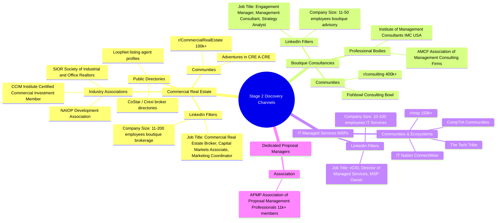

# Candidate ICP Analysis & Reachability — Vertical B2B Deck Automation

**Idea ID:** `deck-automation`  
**Stage:** 1 (Discovery & Hypothesis Validation)  
**Agent:** `workflow-mapping`  
**Status:** Complete  
**Audit Status:** `PENDING`  
**Verdict Note:** Per Workspace Rule 17 & Rule 19, this report does not issue a final Stage 1 PASS/FAIL decision. Candidate ICPs from the hypothesis are evaluated as hypotheses against empirical evidence.

---

## 1. Candidate ICP Evaluation & Segment Status

The initial hypothesis suggested 6 candidate segments:
1. B2B SaaS Account Executives
2. Sales Enablement Teams
3. Boutique Consultancies
4. Agencies Producing Client Decks
5. Professional-Services Firms
6. Commercial Real Estate Teams

Based on 16 verified workflow records and cross-cutting market/pain research, the candidate segments are evaluated below:

```
+---------------------------------------------------------------------------------------------------+
| CANDIDATE SEGMENT STATUS SUMMARY                                                                  |
+---------------------------------------------------------------------------------------------------+
| 1. Commercial Real Estate (CRE) Teams:    PROMOTED TO PRIMARY ICP (Highest WTP, 12hr-2wk pain)   |
| 2. Boutique Consultancies:                VALIDATED AS VIABLE (Strict native PPTX add-in need)   |
| 3. IT Managed Service Providers (MSPs):   NEW EMPIRICAL CANDIDATE (Added from field evidence)     |
| 4. B2B SaaS Account Executives:           CHALLENGED / DEPRIORITIZED (10-15m template workaround) |
| 5. Sales Enablement Teams:                PLAUSIBLE BUT HIGH BARRIER (Enterprise procurement)    |
| 6. Marketing & Creative Agencies:         DOWNGRADED / POOR FIT (Web proposal substitutes, low WTP)|
+---------------------------------------------------------------------------------------------------+
```

---

## 2. Deep-Dive Segment Evaluations

### 2.1 Commercial Real Estate (CRE) Brokerage & Capital Markets Teams

* **Hypothesis vs. Evidence Reality:**
  - *Hypothesis:* CRE teams adapt pitch decks for properties.
  - *Empirical Reality:* The job is far more intensive than a standard pitch deck. It is the production of comprehensive **Offering Memorandums (OMs)** and **Broker Opinions of Value (BOVs)** running 30 to 80+ pages.
* **Evidence Grounding:**
  - `ev-wf-cre-om-12hr-buildout`: Brokers report spending **12 hours per OM** in standard template software (Buildout).
  - `ev-wf-cre-designer-indesign-bottleneck`: CRE firms employ dedicated in-house designers whose entire full-time job is building OMs in InDesign.
  - `ev-wf-cre-om-turnaround-investor`: Institutional listing agreements enforce strict **1–2 week** turnaround deadlines for complete marketing books.
  - `ev-wf-cre-assembly-line-redlining`: The workflow follows a rigid assembly line (Analyst $\rightarrow$ Coordinator $\rightarrow$ Designer $\rightarrow$ Senior Broker redlining over 1–2 weeks).
  - `ev-wf-cre-marketing-coordinator-role`: Job descriptions at Cushman & Wakefield confirm dedicated coordinators compile data specifically for graphic designers to format.
* **Workflow Frequency:** `per_opportunity` (2–6 listing packages/BOVs per active broker team per month).
* **Observed Budget Authority & WTP:**
  - Average transaction commission ranges from **$50,000 to $500,000+** per deal.
  - Brokerage teams routinely pay **$500 to $1,500/month** for marketing software (Buildout/RealNex) or **$60k–$75k/year** for dedicated marketing coordinators.
  - Software cost is negligible relative to listing commissions.
* **Fit with Founder MVP Constraints:**
  - *Strengths:* Clear data inputs (Rent Roll Excel, T12 P&L, property specs); highly repetitive slide layout structures (executive summary, rent roll table, financial overview, location maps).
  - *Risks to Monitor:* Requires high aesthetic polish (traditionally dominated by Adobe InDesign). MVP must generate either publication-grade PPTX or direct PDF export.
* **Segment Verdict:** **Promoted to Primary Candidate ICP for Stage 2 Interviews.**

---

### 2.2 Boutique Consultancies & Management Advisory (10–100 consultants)

* **Hypothesis vs. Evidence Reality:**
  - *Hypothesis:* Consultancies spend recurring time adapting presentations.
  - *Empirical Reality:* Validated. Over 90% of deliverables are assembled from past engagement slides. Analysts spend 30% of their working hours manually updating tables, aligning text boxes, and recalculating MoM/YoY growth rates.
* **Evidence Grounding:**
  - `ev-wf-consulting-monthly-deck-copy-paste`: Analysts spend **2–3 hours** per monthly deck manually updating 60 figures cell-by-cell.
  - `ev-wf-consulting-claude-skills-breakage`: Teams abandon fragile Excel-linked Think-cell objects and experiment with Claude skills to automate PMO and SteerCo decks.
  - `ev-pain-consulting-thirty-percent-time`: Consultants report spending **30% of daily working time** formatting PowerPoint slides.
* **Workflow Frequency:** `monthly` per retainer client; `weekly` for PMO workstreams; `per_opportunity` for competitive RFPs.
* **Observed Budget Authority & WTP:**
  - High willingness to pay: Consultancies already purchase Think-cell licenses ($250+/user/year) and specialized Office add-ins (UpSlide). Software can be expensed to client project codes or firm G&A.
* **Fit with Founder MVP Constraints:**
  - *Critical Constraint:* **100% Native Microsoft PowerPoint (.pptx) strictly required.** Enterprise clients prohibit web links (Gamma, Pitch) or static non-editable files.
  - *Security Hurdle:* Client NDAs make web-first cloud uploading sensitive. A local-first or desktop add-in approach is strongly preferred.
* **Segment Verdict:** **Validated Secondary Candidate ICP.** Highly attractive workflow, subject to native PPTX delivery constraints.

---

### 2.3 IT Managed Service Providers (MSPs) / Professional Services

* **Hypothesis vs. Evidence Reality:**
  - *Hypothesis:* Professional services firms create customer-facing collateral.
  - *Empirical Reality:* Emerged from field research as a distinct, highly standardized sub-segment. MSPs run mandatory **Quarterly Business Reviews (QBRs)** and Strategic Technology Reviews for every managed business client.
* **Evidence Grounding:**
  - `ev-wf-msp-qbr-multi-tool-drain`: vCIOs spend **2–4 hours per client review** manually pulling ticket stats, backup logs, and security scores from PSA/RMM tools into PowerPoint decks.
  - Field discussions reveal existing QBR software generates canned, un-editable "shiny PDFs" that business owners ignore, forcing vCIOs back into PowerPoint customization.
* **Workflow Frequency:** `quarterly` per contract client. For an MSP with 40 managed clients, this represents **10–13 reviews per month**.
* **Observed Budget Authority & WTP:**
  - MSP owners and vCIOs have direct budget authority and routinely subscribe to specialized MSP tooling ($100–$300/month per technician).
* **Fit with Founder MVP Constraints:**
  - *Strengths:* Highly structured data inputs (ticket counts, SLA%, M365 Secure Score, hardware lifecycle tables); predictable 15-slide output.
  - *Risks to Monitor:* Requires API integrations into MSP tools (ConnectWise, Autotask, HaloPSA).
* **Segment Verdict:** **New Empirical Candidate ICP.** Highly promising for Stage 2 discovery.

---

### 2.4 B2B SaaS Account Executives (Deprioritized)

* **Hypothesis vs. Evidence Reality:**
  - *Hypothesis:* Quota-carrying AEs create customer-specific sales decks frequently and will pay for automation.
  - *Empirical Reality:* **Challenged.** Reps actively resist complex deck customization. Disciplined sales teams use structured master PowerPoint files that compress deck creation to **10–15 minutes** (`ev-wf-saas-ae-master-slide-workaround`), while modern consultative sellers avoid slide presentations entirely in favor of live software demos (`ev-wf-saas-ae-conversational-rejection`).
* **Evidence Grounding:**
  - `ev-wf-saas-ae-master-slide-workaround`: Head of Regions confirms a 100-slide master file allows reps to copy 6 core slides in 10–15 minutes.
  - `ev-wf-saas-ae-conversational-rejection`: Senior AEs assert slides disengage buyers and prefer conversational discovery.
  - `ev-pain-faang-no-deck-workflow`: Enterprise tech reps report not presenting a slide deck in years.
* **Workflow Frequency:** `per_opportunity` (2–6 pitches/week), but actual slide customization is brief or skipped.
* **Observed Budget Authority & WTP:**
  - Individual reps have zero budget authority; reliant on company-provided tooling.
  - High churn risk if sold as individual prosumer SaaS.
* **Segment Verdict:** **Deprioritized as Primary Target.** Keep as an observation segment; do not anchor initial MVP on AE self-service.

---

### 2.5 Sales Enablement Teams (Mid-Market & Enterprise)

* **Hypothesis vs. Evidence Reality:**
  - *Hypothesis:* Enablement teams automate and manage slide collateral.
  - *Empirical Reality:* Enablement teams do own collateral governance and slide libraries (`ev-wf-enablement-governance-translation`). However, they serve large sales organizations (100+ reps) and are already heavily targeted by enterprise giants (Highspot, Seismic, Templafy) with 6-figure ACVs.
* **Evidence Grounding:**
  - `ev-wf-enablement-governance-translation`: Job postings at SpaceX/BMO confirm enablement manages centralized slide libraries and message governance.
  - `ev-mkt-highspot-autodocs`: Highspot AutoDocs already solves CRM-to-PPTX dynamic deck generation for enterprise Salesforce teams.
* **Fit with Founder MVP Constraints:**
  - Long enterprise sales cycles (6–12 months), mandatory SOC2 compliance, procurement gauntlets, and heavy custom integration work make this an impractical initial beachhead for a solo technical founder.
* **Segment Verdict:** **Plausible Future Expansion, Unviable Initial Beachhead.**

---

### 2.6 Marketing & Creative Agencies (Downgraded)

* **Hypothesis vs. Evidence Reality:**
  - *Hypothesis:* Agencies create client decks and proposals frequently.
  - *Empirical Reality:* **Downgraded.** Agencies have widely adopted modern web-based interactive proposal software (Qwilr, PandaDoc, Proposify) because they value view tracking and e-signatures more than editable PPTX output (`ev-wf-agency-interactive-qwilr-substitute`). Smaller agencies delegate Google Slides customization to low-cost virtual assistants (`ev-wf-agency-proposal-slides-assistant`).
* **Evidence Grounding:**
  - `ev-wf-agency-proposal-slides-assistant`: Agency owners use Google Slides + discovery notes + virtual assistants.
  - `ev-wf-agency-interactive-qwilr-substitute`: Agencies switch to Qwilr for interactive web pages and engagement analytics.
  - `ev-wf-agency-rfp-resource-drain`: High manual time invested in RFPs correlates with low win rates (<25%), causing agency owners to standardize proposals rather than invest in expensive software.
* **Segment Verdict:** **Downgraded / Poor Candidate for PPTX Automation.**

---

## 3. Stage 2 Reachability & Discovery Channels

Per validation rules, this section outlines **where and how Stage 2 prospects can be discovered** across the top-ranked candidate segments (without building the full prospect list yet).



### 3.1 Search Filters & Discovery Channels for CRE Brokerages (Primary)
* **LinkedIn Sales Navigator Search Filters:**
  - *Current Job Title:* `Commercial Real Estate Broker`, `Investment Sales Broker`, `Capital Markets Associate`, `Director of Marketing`, `Brokerage Coordinator`.
  - *Industry:* `Commercial Real Estate`.
  - *Company Headcount:* `11–50 employees`, `51–200 employees` (captures independent and regional brokerages, avoiding corporate CBRE/JLL procurement).
* **Industry & Public Directories:**
  - **CCIM Institute Member Directory** (ccim.com): Searchable directory of commercial investment brokers.
  - **SIOR Member Directory** (sior.com): Specializes in industrial and office transaction brokers.
  - **Crexi & LoopNet Listing Pages**: Identify active listing agents on commercial assets ($2M–$20M) with public phone and email contacts.
* **Online Communities:**
  - Subreddit: `r/CommercialRealEstate` (100k+ members);
  - Forum: *Adventures in CRE* (A.CRE);
  - Local Real Estate Board events (e.g., NAIOP regional chapter breakfasts).

### 3.2 Search Filters & Discovery Channels for Boutique Consultancies
* **LinkedIn Sales Navigator Search Filters:**
  - *Current Job Title:* `Engagement Manager`, `Management Consultant`, `Senior Associate`, `Managing Director`.
  - *Industry:* `Management Consulting`, `Strategic Management`.
  - *Company Headcount:* `11–50 employees`, `51–200 employees` (independent boutique firms).
* **Industry Directories & Groups:**
  - **Institute of Management Consultants (IMC USA)** member directory;
  - **Vault.com Boutique Consulting Rankings** (identifies top 50 boutique strategy consultancies).
* **Communities:**
  - Subreddit: `r/consulting` (400k+ members);
  - Fishbowl: *Consulting Bowl* (practitioner discussions on deck-building pain).

### 3.3 Search Filters & Discovery Channels for IT MSPs
* **LinkedIn Sales Navigator Search Filters:**
  - *Current Job Title:* `vCIO`, `Virtual CIO`, `Director of Client Services`, `Owner`, `President`.
  - *Industry:* `IT Services and IT Consulting`.
  - *Company Headcount:* `11–50 employees`.
* **Communities & Directories:**
  - **The Tech Tribe** (largest global peer community of MSP owners);
  - Subreddit: `r/msp` (150k+ members);
  - ConnectWise IT Nation partner directory.

### 3.4 Search Filters for Dedicated Proposal Professionals
* **Association of Proposal Management Professionals (APMP):**
  - Represents **11,000+ member professionals** globally (`ev-wf-reachability-apmp-association`).
  - LinkedIn search: Members of APMP or holding `CP APMP` certification.
  - Job title: `Bid Manager`, `Proposal Manager`, `RFP Coordinator`.

---

## 4. Summary & Stage 2 Transition Recommendations

1. **Focus Stage 2 Prospecting on CRE & Boutique Advisory:**
   - CRE Brokerage Teams offer the sharpest pain point (12 hours to 2 weeks per deal book) and the highest ability to pay without enterprise software procurement friction.
   - Boutique Consultancies offer the highest recurrence of native PowerPoint updates (2–3 hours/month per client), but interviews must probe confidentiality/security tolerance.

2. **Hypothesis Adjustments Required for Stage 2:**
   - Refine the hypothesis from generic *"B2B sales pitch decks"* to **high-stakes opportunity collateral** (Offering Memorandums, BOVs, and SteerCo advisory deliverables).
   - Recognize that generic AEs are largely satisfied with master PowerPoint copy-paste workarounds or live demos, whereas multi-page document-heavy teams are severely underserved.
