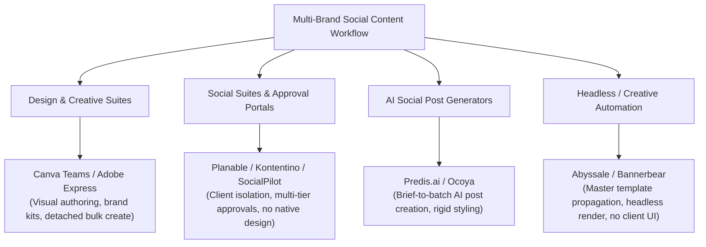

# Market Map: Multi-Brand Static Social Content Production

## 1. Scope & Objective
This market map evaluates existing software alternatives, adjacent platforms, and complete substitutes for **MULTIBRAND-OPERATOR-01**: independent social media managers (SMM) and owner-led agencies producing recurring organic static content and carousels for multiple unrelated SMB clients.

The investigation directly tests whether the proposed core wedge—multi-brand context isolation, brief-to-post generation, revision propagation, and client review handoff—is already addressed by existing design tools, social management suites, creative automation platforms, or AI generators.

---

## 2. Competitor & Substitute Landscape

The landscape partitions into four primary categories:

### 2.1 Design & Template Platforms (Visual Authoring Incumbents)
- **Canva (Teams / Enterprise)**:
  - *Brand Isolation*: Offers up to 100 Brand Kits on Business/Teams plans (`mb-market-001`), allowing centralized storage of logos, fonts, palettes, and brand guidelines with quick switching in the editor.
  - *Batch Generation*: Native **Bulk Create** connects CSV/spreadsheet data to design fields, generating up to 300 pages (`mb-market-002`).
  - *Revision Propagation*: **Detached Output.** Generated designs exist as detached, static pages. Changes to the underlying master template do not retroactively propagate to generated pages (`mb-market-002`), forcing manual multi-page editing or complete regeneration.
  - *Approvals*: Internal team-only design approvals requiring paid seats; no native client guest review link without workspace access (`mb-market-004`).
  - *Pricing*: Pro is $15/month or $120/year; Teams starts at $100/seat/year (3-seat minimum = $300/year) (`mb-market-003`).
- **Adobe Express**:
  - *Brand Isolation*: Brand Kits sync with Adobe Creative Cloud Libraries across Photoshop and Illustrator (`mb-market-005`).
  - *Batch Generation*: Bulk Create add-on populates design variations from spreadsheet data (`mb-market-006`).
  - *Revision Propagation*: Linked CC Library assets update dynamically, but layout-level text reflow and template alterations do not cascade across generated variants (`mb-market-006`).
  - *Pricing*: Premium is $9.99/month ($99.99/year); Teams is $6.49/seat/month billed annually with a 2-seat minimum ($12.99/seat/month monthly) (`mb-market-007`).

### 2.2 Social Suites & Client Approval Portals (Workflow Incumbents)
- **Planable**:
  - *Brand Isolation*: Dedicated workspaces provide strict brand separation and custom role-based client review permissions (`mb-market-008`).
  - *Review & Approvals*: Four approval workflows: None, Optional, Required (sign-off blocker), and Multi-level sequential sign-off. External guests can review and approve without consuming paid seats (`mb-market-009`).
  - *Graphic Capabilities*: No native graphic authoring or dynamic batch rendering; relies on static file uploads or embedded Canva buttons (`mb-market-009`).
  - *Pricing*: Priced per workspace ($33/workspace/month Basic, $50/workspace/month Pro billed annually) with unlimited users on all plans (`mb-market-010`).
- **Kontentino**:
  - *Brand Isolation*: Client profiles segregate access; Brand Hub houses client-specific assets and templates (`mb-market-011`).
  - *Review & Approvals*: 1-click external client approval links requiring no client login or password, supporting internal team review followed by client sign-off (`mb-market-012`).
  - *Pricing*: €49/month billed annually for 10 profiles (Starter), €109/month for 40 profiles (Standard), €199/month for unlimited profiles (Pro) (`mb-market-013`).
- **SocialPilot & Buffer**:
  - *Brand Isolation & Approvals*: SocialPilot provides client sub-accounts and white-label client approval dashboards from $85/month (`mb-market-014`, `mb-market-015`). Buffer offers Agency plans at $100/month for 10 channels with draft approval routing (`mb-market-016`). Neither renders graphics natively.

### 2.3 AI Social Content Generators
- **Predis.ai**:
  - *Capabilities*: Generates batches of 10–30 complete post concepts (visual creatives, carousels, and matching captions) from text prompts or briefs, applying saved brand colors, logos, and brand voice (`mb-market-017`).
  - *Revision & Export*: Generates flat raster images (PNG/JPG) or MP4 video; lacks dynamic template revision propagation and native editable vector/layered exports (`mb-market-017`).
  - *Pricing*: Core is $24/month (1 brand), Rise is $55/month (up to 4 brands), and Enterprise+ is $212/month billed annually for unlimited brands (`mb-market-018`).
- **Ocoya**:
  - *Capabilities*: Offers AI copywriting ("Travis AI") and social post generation across multi-brand workspaces, pooling credits and social profiles (`mb-market-019`).
  - *Pricing*: Team is $65/month billed annually (20 profiles); Agency is $165/month (100 profiles, unlimited workspaces) (`mb-market-019`).

### 2.4 Headless & Programmatic Creative Automation (Substitutes)
- **Abyssale**:
  - *Capabilities*: Programmatic image and banner automation from master templates via CSV, Google Sheets, or API. Master template modifications cascade dynamically across entire generated asset batches (`mb-market-020`). Includes built-in design approvals on the Pro tier (`mb-market-020`).
  - *Limitations*: Tailored for advertising banners rather than organic social content; lacks native caption generation, social editorial calendar views, and publishing connectors.
  - *Pricing*: Pro plan is $36/seat/month billed annually ($45/seat/month monthly) (`mb-market-020`).
- **Bannerbear**:
  - *Capabilities*: Headless template-to-image API rendering with multi-project brand isolation (`mb-market-021`).
  - *Limitations*: Requires technical assembly via Zapier, Make, or custom webhooks; has no native practitioner UI or client review portal (`mb-market-021`).
  - *Pricing*: Starts at $49/month for 1,000 renders up to $149/month for 10,000 renders (`mb-market-021`).

---

## 3. Workflow Comparison: Combined Stacks vs. Proposed Engine

A central finding of this market analysis is that **the proposed workflow is currently addressed by stitching together two distinct tools**:

| Workflow Step | Design Tool (e.g., Canva / Adobe) | Approval Suite (e.g., Planable / Kontentino) | AI Generator (e.g., Predis.ai) | Creative Automation (e.g., Abyssale) | Proposed Engine |
| :--- | :--- | :--- | :--- | :--- | :--- |
| **Brand Isolation** | Brand Kits (up to 100) (`mb-market-001`) | Isolated Workspaces (`mb-market-008`, `mb-market-011`) | Brand Profiles (`mb-market-017`) | Projects / Sub-accounts (`mb-market-020`) | Isolated Brand Contexts |
| **Brief-to-Draft** | Manual template layout | None (text placeholder) | Automated AI batch (`mb-market-017`) | CSV / Sheet import (`mb-market-020`) | Automated batch draft |
| **Revision Propagation** | **None** (detached pages) (`mb-market-002`) | N/A (manages media files) | **None** (detached outputs) (`mb-market-017`) | **Full** (dynamic template) (`mb-market-020`) | Hypothesized dynamic reflow |
| **Client Review / Sign-off** | Internal seats only (`mb-market-004`) | **1-Click Guest Links** (`mb-market-009`, `mb-market-012`) | Internal comments only (`mb-market-017`) | Internal review (`mb-market-020`) | Client review portal / export |
| **Editable Export** | Canva link / PDF / flat image (`mb-market-003`) | Social publish / PDF calendar (`mb-market-010`) | Flat raster (PNG/JPG) (`mb-market-017`) | Flat raster / Vector PDF (`mb-market-020`) | Reviewable pack / export |

### Strategic Gap Analysis:
1. **The Batch Propagation Gap**:
   In Canva and Adobe Express, generating 20–30 posts via Bulk Create produces a detached document (`mb-market-002`, `mb-market-006`). When a client requests a global template change (e.g., repositioning a handle, adjusting font sizing, or changing brand colors across the batch), the operator must either manually edit all 30 pages individually or re-run the bulk generation and re-apply post-specific copy edits.
2. **The Design vs. Approval Bifurcation**:
   Agencies currently pay for a dual stack: a design tool for authoring ($15–$30/mo) and an approval suite for client sign-off ($33–$109/mo) (`mb-market-003`, `mb-market-010`, `mb-market-013`). Transferring drafts from Canva to Planable requires manual export/import or clicking embedded widgets.
3. **Editable Export Walled Gardens**:
   No mainstream incumbent provides editable, layered exports to third-party open formats (e.g., native layered Figma or PSD files). Tool lock-in is enforced via proprietary template links (`mb-market-003`).

---

## 4. Benchmark Pricing Context
All pricing figures below represent published competitor prices (`money_signal: "competitor_price"`); they do not constitute revealed willingness to pay:

| Platform | Model | Price Benchmark (Annual / Monthly) | Evidence ID |
| :--- | :--- | :--- | :--- |
| **Canva Pro / Teams** | Per seat | $15/mo individual; $100/seat/yr (3-seat min = $300/yr) | `mb-market-003` |
| **Adobe Express Teams** | Per seat | $6.49/seat/mo billed annually ($12.99 monthly, 2-seat min) | `mb-market-007` |
| **Planable Pro** | Per workspace | $50/workspace/mo ($59 monthly, unlimited users) | `mb-market-010` |
| **Kontentino Standard** | Per profiles bundle | €109/mo (€145 monthly, 40 profiles, 10 users) | `mb-market-013` |
| **SocialPilot Premium** | Per accounts bundle | $85/mo ($100 monthly, 20 accounts, client management) | `mb-market-015` |
| **Buffer Agency** | Per channels bundle | $100/mo ($120 monthly, 10 channels) | `mb-market-016` |
| **Predis.ai Rise** | Per brand bundle | $55/mo ($79 monthly, up to 4 brands) | `mb-market-018` |
| **Ocoya Team** | Per profiles bundle | $65/mo ($79 monthly, 20 profiles) | `mb-market-019` |
| **Abyssale Pro** | Per seat + credits | $36/seat/mo ($45 monthly, 5,400 credits/yr) | `mb-market-020` |
| **Bannerbear Scale** | Per render volume | $149/mo (10,000 credits/mo) | `mb-market-021` |

---

## 5. Key Falsification & Market Findings for Stage 1

1. **Brand Isolation is Already Commoditized**:
   Canva (`mb-market-001`), Adobe Express (`mb-market-005`), Planable (`mb-market-008`), Kontentino (`mb-market-011`), and Predis.ai (`mb-market-017`) all provide dedicated brand asset repositories and workspace isolation. Brand isolation alone is not a viable wedge.
2. **Client Approval Infrastructure is Mature**:
   Planable (`mb-market-009`) and Kontentino (`mb-market-012`) offer polished, frictionless 1-click external guest approvals with multi-tier sign-offs. Replicating an approval tool alone faces entrenched competition.
3. **AI Brief-to-Post Batching Exists**:
   Predis.ai (`mb-market-017`) and Ocoya (`mb-market-019`) already generate 10–30 post concepts (visuals + copy) from single briefs across multiple brands.
4. **The Unresolved Workflow Friction**:
   The primary friction observed in current market architecture is the **bridge between dynamic design template propagation and multi-client approval**:
   - High-end creative automation tools (Abyssale `mb-market-020`, Bannerbear `mb-market-021`) solve template propagation, but lack client review UX and organic social post drafting.
   - Design suites (Canva `mb-market-002`) lack dynamic revision propagation across generated batches.
   - Approval suites (Planable `mb-market-009`) lack native design engines.
   Whether operators experience this friction keenly enough to switch from their existing two-tool stack (Canva + Planable/Kontentino) depends on empirical pain and willingness-to-pay findings from the Pain and WTP research tracks.
